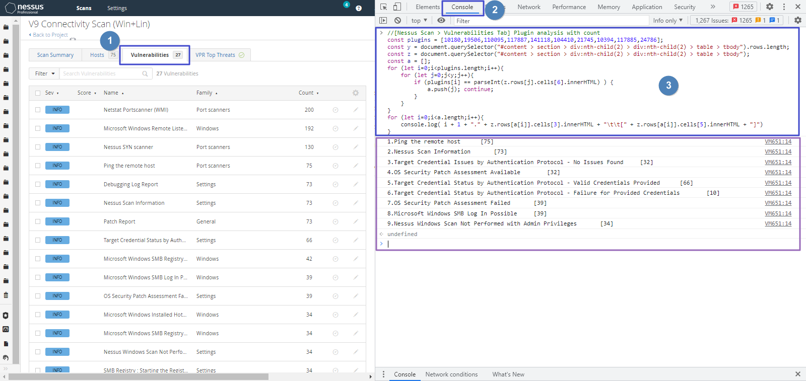

# Nessus Scan Analysis - JavaScript

## Usecase  

Script to run on web browser console to check how many hosts (and ports) were reported under particular plugin.

**Note:** This script works for for output types mentioned in the screenshot below. If the nessus plugin contains different formatted output or nessus change it's DOM, you will need to modify the script as per your needs.


## Usage

1. Open the plugin in the Nessus scan results. For example _"Target Credential Status by Authentication Protocol - Valid Credentials Provided"_

2. Open develoepr tools in the web browser (Shortcut: F12) and navigate to console tab

3. Copy and paste the javascript code in web browser console
4. Output shows the details and the reported server, which is tab formatted (easy to copy & paste in excel)

```JavaScript 
//Scan name, plugin details
const scan_name = document.querySelector("#titlebar > h1").innerHTML;
const scan_name2 = scan_name.split('\n'); //scan_name2[0]
const plugin_id = document.querySelector("#content > section > div.right-column > div:nth-child(2) > span:nth-child(5)").innerText; 
const plugin_name = document.querySelector("#content > section > div.main-column > div.plugin-details-header > h4").innerHTML; 

//get the list of output sections
const op_count = document.querySelector("#content > section > div.main-column > div:nth-child(3) > ul").querySelectorAll('li'); 
const outputs=[];
const port=[];

//get the list of hosts in the output sections
for (let i = 0; i < op_count.length; i++) {
//console.log("Now checking: " + i)
outputs[i] = document.getElementsByClassName("plugin-output-wrapper")[i].querySelectorAll("a");
port[i] = document.getElementsByClassName("plugin-output-wrapper")[i].querySelectorAll('td > span')[0].innerHTML;
}

//Convert obj to array
const arr2 = Object.entries(outputs);
arr2[0][1].length

//Count total hosts and the individual count
hosts_port_count = 0
hosts_port_out = ""

for (let i = 0; i < op_count.length; i++) {
	hosts_port_out += "\t\tPort Output & Count of hosts [" +i+"] : [" + port[i] + "] : " + arr2[i][1].length + "\n"
	hosts_port_count += arr2[i][1].length
}

//Print the output in formatted form
console.log("Scan Name:\t" + scan_name2[0] + "\nPlugin ID:\t" + plugin_id + "\nPlugin Name:\t" + plugin_name +  "\nTotal Hosts :\t" + hosts_port_count + "\nIndividual Host count :\n" + hosts_port_out + "\n\n")

sno_counter=0
for (let i = 0; i < op_count.length; i++) {
	for (let j = 0; j < arr2[i][1].length; j++) {
		sno_counter += 1
		console.log(sno_counter + ".\t" + plugin_id +"\t"+ port[i] +"\t"+ arr2[i][1][j].innerHTML)
	//outputs[i] = document.getElementsByClassName("plugin-output-wrapper")[i].querySelectorAll("a");
	}
}
```

## Screenshots:
1.Showing where to paste the above JS code and what is the expected output
<kbd></kbd>

2.Showing the output tables and their count of identified servers
<kbd></kbd>

3.Showing the output copied to Excel for further analysis/preparing reports
<kbd></kbd>

