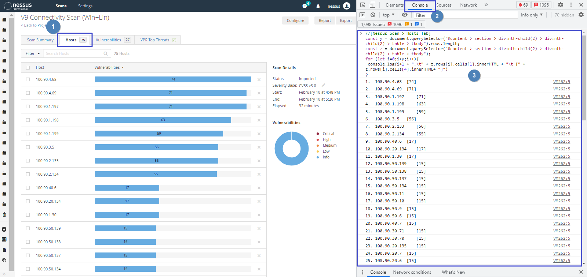
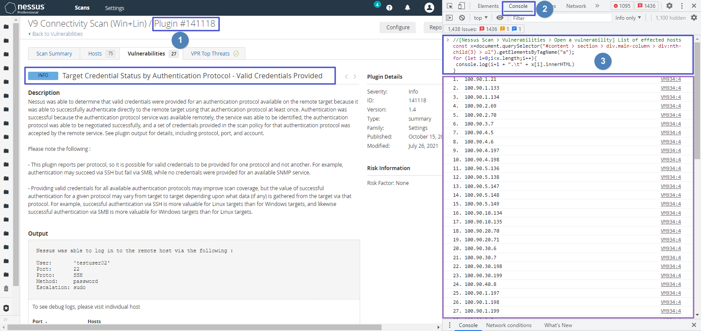
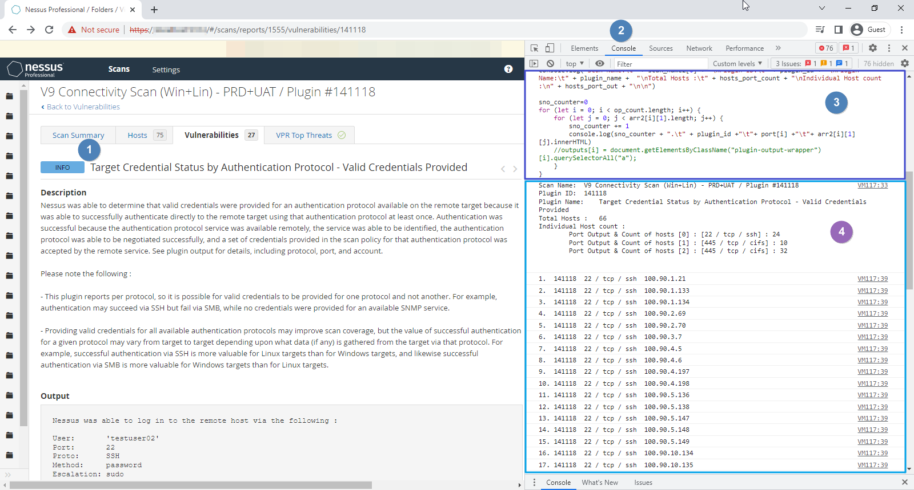
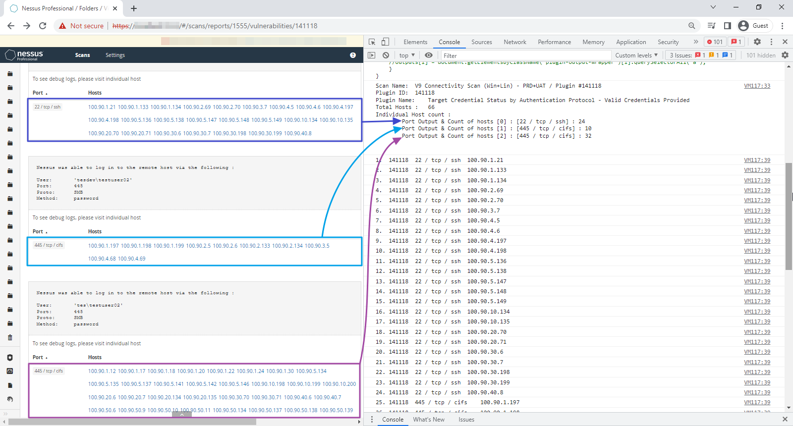
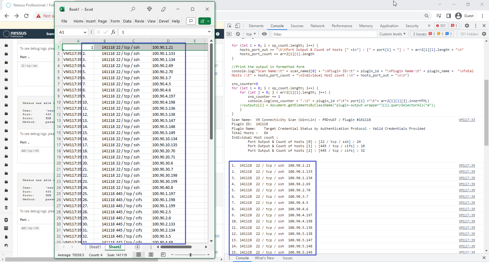

# Nessus Authentication Scan Results Analysis using JavaScript
Javascript code to interact with DOM and collect the scan details in tab format.

**Alternative reference:** https://medium.com/@vinay-infosec/nessus-authentication-scan-results-analysis-using-javascript-1b28b381a851

**Tool Used:** Nessus Professional v10.4.2

**Tested on:** Chrome & Edge

**Note:** This script works for for output types mentioned in the screenshot below. If the nessus plugin contains different formatted output or nessus change it's DOM, you will need to modify the script as per your needs.


## Table of contents
[Usecase-1A: Get the list of hosts](#javascript-code-1alist-of-hosts)

[Usecase-1B: Get the list of hosts and the count of Critical, High, Medium, Low severity vulnerabilities](#javascript-code-1blist-of-hosts--count)

[Usecase-2: Get the count of few important plugins](#javascript-code-2summary-of-imp-plugins)

[Usecase-3A: Get the list of reported hosts from the plugin output (Quick & Concise)](#javascript-code-3aplugin-output---quick--concise)

[Usecase-3B: Get the list of reported hosts from the plugin output (More detailed)](#javascript-code-3bplugin-output---detailed)


## Q&A


**Where to use this JavaScript code?** 
1. Navigate to the respective page in web browser (mentioned in __"Where to use"__ section for all usecases)
2. Open develoepr tools in the web browser (Shortcut: F12) and navigate to console tab
3. Copy and paste the javascript code in web browser console
4. Output shown based on usecase, which is tab formatted (easy to copy & paste in excel)


**How does this script works?** 
Script work by getting the output from web browser DOM. So, make sure your DOM is loaded properly before executing the script.


## Tips
**Tip-1:** Increase the “Results per page” count to max.


**Tip-2:** Scroll the web page to the bottom to load all elements available.


**Tip-3:** You can download the Nessus auth scan policy from [my github channel](../Config_Files/)

---
## Usecase-1A: Get the list of hosts
Use the following script to get the list of hosts and the count of plugins reported for that host.

**Where to use:** Open the Nessus scan results and go to the **Hosts** tab

**Expected output:**
```
1. 100.90.4.68  [74]
2. 100.90.4.69  [71]
3. 100.90.1.197  [71]
4. 100.90.1.198  [63]
```


### Javascript Code (1A.List of hosts)
```JavaScript
//[Nessus Scan > Hosts Tab]
const y = document.querySelector("#content > section > div:nth-child(2) > div:nth-child(2) > table > tbody").rows.length; 
const z = document.querySelector("#content > section > div:nth-child(2) > div:nth-child(2) > table > tbody");
for (let i=0;i<y;i++){
 console.log(i+1 + ".\t" + z.rows[i].cells[1].innerHTML + "\t [" + z.rows[i].cells[4].innerHTML+ "]")
}
```
[Go to - ToC](#table-of-contents)


### Sample Screenshot
<kbd></kbd>


---
## Usecase-1B: Get the list of hosts and the count of Critical, High, Medium, Low severity vulnerabilities
Use the following script to get the list of hosts and the count of plugins reported for that host.

**Where to use:** Open the Nessus scan results and go to the **Hosts** tab

**Expected output:**
```
1.	10.11.127.109	[225] [ High: 5 (2.22%) Medium: 7 (3.11%) Low: 1 (0.44%)  ]
2.	10.11.121.173	[222] [ High: 4 (1.80%) Medium: 6 (2.70%)  ]
3.	10.11.122.66	[215] [ High: 4 (1.86%) Medium: 9 (4.19%) Info: 202 (93.95%) ]
4.	10.11.122.67	[215] [ High: 4 (1.86%) Medium: 9 (4.19%)  ]
5.	10.11.127.100	[214] [ High: 3 (1.40%) Medium: 5 (2.34%)  ]
6.	10.11.127.107	[214] [ High: 4 (1.87%) Medium: 9 (4.21%)  ]
7.	10.11.127.98	[207] [ High: 3 (1.45%) Medium: 5 (2.42%)  ]
8.	10.11.121.174	[199] [ High: 2 (1.01%) Medium: 5 (2.51%)  ]
9.	10.11.127.106	[192] [ High: 4 (2.08%) Medium: 9 (4.69%)  ]
10.	10.11.121.172	[187] [ High: 3 (1.60%) Medium: 5 (2.67%)  ]
```


### Javascript Code (1B.List of hosts & count)
```JavaScript
//[Nessus Scan > Hosts Tab] List of hosts (for actual scan with Critical + High + Medium + Low + Info)
const y = document.querySelector("#content > section > div:nth-child(2) > div:nth-child(2) > table > tbody").rows.length; 
const z = document.querySelector("#content > section > div:nth-child(2) > div:nth-child(2) > table > tbody");
for (let i=0;i<y;i++){
	let op = ""
	const ab = z.rows[i].cells[2].getElementsByTagName("li")
	for(let j=0;j<ab.length;j++){
		op += ab[j].title + " "
	}
	console.log(i+1 + ".\t" + z.rows[i].cells[1].innerHTML + "\t[" + z.rows[i].cells[4].innerHTML + "] [ " + op + "]")	
}
```
[Go to - ToC](#table-of-contents)


### Sample Screenshot
<kbd></kbd>


---
## Usecase-2: Get the count of few important plugins
Use the following script to get the list of few important plugins reported in the scan and the count of plugins output (for all hosts detected).


**Where to use:** Open the Nessus scan results and go to the **Vulnerabilities** tab.

**Expected output:** 
```
1.Ping the remote host  [75]
2.Nessus Scan Information  [73]
3.Target Credential Issues by Authentication Protocol - No Issues Found  [32]
4.OS Security Patch Assessment Available  [32]
5.Target Credential Status by Authentication Protocol - Valid Credentials Provided  [66]
6.Target Credential Status by Authentication Protocol - Failure for Provided Credentials  [10]
7.OS Security Patch Assessment Failed  [39]
8.Microsoft Windows SMB Log In Possible  [39]
9.Nessus Windows Scan Not Performed with Admin Privileges  [34]
```


### Javascript Code (2.Summary of imp plugins)

**Old javascript code - duplicate hosts will not be detected**
```JavaScript
//[Nessus Scan > Vulnerabilities Tab] Plugin analysis with count
const plugins = [10180,19506,110095,117887,141118,104410,21745,10394,117885,24786];
const y = document.querySelector("#content > section > div:nth-child(2) > div:nth-child(2) > table > tbody").rows.length; 
const z = document.querySelector("#content > section > div:nth-child(2) > div:nth-child(2) > table > tbody");
const a = [];
for (let i=0;i<plugins.length;i++){
 for (let j=0;j<y;j++){
  if (plugins[i] == parseInt(z.rows[j].cells[6].innerHTML) ) {
   a.push(j); continue;
  }
 }
}
for (let i=0;i<a.length;i++){
 console.log( i + 1 + "." + z.rows[a[i]].cells[3].innerHTML + "\t\t[" + z.rows[a[i]].cells[5].innerHTML + "]")
}
```


**New javascript code - duplicate hosts will be detected**
```JavaScript
//[Nessus Scan > Vulnerabilities Tab] Plugin analysis with count - Updated with duplicate host detection
const x = document.querySelector("#content > section > div.main-column > div:nth-child(3) > ul").getElementsByTagName("a");
const all_hosts = [];

for (let i = 0; i < x.length; i++) {
  all_hosts.push(x[i].innerHTML);
}

const unique_hosts = new Set(all_hosts);

if (unique_hosts.size === all_hosts.length) {
  console.log("Total hosts: " + all_hosts.length + "\n\nAll '" + unique_hosts.size + "' hosts are unique. No duplicate hosts found.");
  all_hosts.forEach((host, index) => {
    console.log(index + 1 + ".\t" + host);
  });
} else {
  console.log("Total hosts: " + all_hosts.length + "\nUnique hosts: " + unique_hosts.size + "\n\nDuplicate hosts found.\n\n");
  console.log("\nTotal hosts list: [" + all_hosts.length + "]");
  all_hosts.forEach((host, index) => {
    console.log("Total_" + (index + 1) + ".\t" + host);
  });

  console.log("\nUnique hosts list: [" + unique_hosts.size + "]");
  let uniqueIndex = 1;
  unique_hosts.forEach((host) => {
    console.log("Unique_" + (uniqueIndex++) + ".\t" + host);
  });

  const duplicate_hosts = all_hosts.filter((host, index, arr) => arr.indexOf(host) !== index);
  const uniqueDuplicateHosts = [...new Set(duplicate_hosts)];
  console.log("\nDuplicate hosts list:");
  uniqueDuplicateHosts.forEach((host, index) => {
    console.log("Duplicate_" + (index + 1) + ".\t" + host);
  });
}
```

[Go to - ToC](#table-of-contents)


### Sample Screenshot
<kbd></kbd>


---
## Usecase-3A: Get the list of reported hosts from the plugin output (Quick & Concise)
Use the following script to get the list of reported hosts from the plugin output


**Where to use:** Open the Nessus scan results, go to the Vulnerabilities tab and **__click on any plugin__** to see the reported hosts.

**Expected output:**  
```
1. 100.90.1.21
2. 100.90.1.133
3. 100.90.1.134
4. 100.90.2.69
5. 100.90.2.70
```


### Javascript Code (3A.Plugin output - Quick & Concise)
```JavaScript
//[Nessus Scan > Vulnerabilities > Open a vulnerability] List of effected hosts
const x=document.querySelector("#content > section > div.main-column > div:nth-child(3) > ul").getElementsByTagName("a"); 
for (let i=0;i<x.length;i++){
 console.log(i+1 + ".\t" + x[i].innerHTML)
}
```
[Go to - ToC](#table-of-contents)


### Sample Screenshot
<kbd></kbd>


---
## Usecase-3B: Get the list of reported hosts from the plugin output (More detailed)
Use the following script to get the list of reported hosts from the plugin output.


**Where to use:** Open the Nessus scan results, go to the Vulnerabilities tab and **__click on any plugin__** to see the reported hosts.

**Expected output:**
```
Scan Name:	V9 Connectivity Scan (Win+Lin) - PRD+UAT / Plugin #141118
Plugin ID:	141118
Plugin Name:	Target Credential Status by Authentication Protocol - Valid Credentials Provided
Total Hosts :	66
Individual Host count :
		Port Output & Count of hosts [0] : [22 / tcp / ssh] : 24
		Port Output & Count of hosts [1] : [445 / tcp / cifs] : 10
		Port Output & Count of hosts [2] : [445 / tcp / cifs] : 32

1.	141118	22 / tcp / ssh	100.90.1.21
2.	141118	22 / tcp / ssh	100.90.1.133
3.	141118	22 / tcp / ssh	100.90.1.134
25.	141118	445 / tcp / cifs	100.90.1.197
26.	141118	445 / tcp / cifs	100.90.1.198
```
</details>


### Javascript Code (3B.Plugin output - Detailed)
```JavaScript 
//Scan name, plugin details
const scan_name = document.querySelector("#titlebar > h1").innerHTML;
const scan_name2 = scan_name.split('\n'); //scan_name2[0]
const plugin_id = document.querySelector("#content > section > div.right-column > div:nth-child(2) > span:nth-child(5)").innerText; 
const plugin_name = document.querySelector("#content > section > div.main-column > div.plugin-details-header > h4").innerHTML; 

//get the list of output sections
const op_count = document.querySelector("#content > section > div.main-column > div:nth-child(3) > ul").querySelectorAll('li'); 
const outputs=[];
const port=[];

//get the list of hosts in the output sections
for (let i = 0; i < op_count.length; i++) {
//console.log("Now checking: " + i)
outputs[i] = document.getElementsByClassName("plugin-output-wrapper")[i].querySelectorAll("a");
port[i] = document.getElementsByClassName("plugin-output-wrapper")[i].querySelectorAll('td > span')[0].innerHTML;
}

//Convert obj to array
const arr2 = Object.entries(outputs);
arr2[0][1].length

//Count total hosts and the individual count
hosts_port_count = 0
hosts_port_out = ""

for (let i = 0; i < op_count.length; i++) {
	hosts_port_out += "\t\tPort Output & Count of hosts [" +i+"] : [" + port[i] + "] : " + arr2[i][1].length + "\n"
	hosts_port_count += arr2[i][1].length
}

//Print the output in formatted form
console.log("Scan Name:\t" + scan_name2[0] + "\nPlugin ID:\t" + plugin_id + "\nPlugin Name:\t" + plugin_name +  "\nTotal Hosts :\t" + hosts_port_count + "\nIndividual Host count :\n" + hosts_port_out + "\n\n")

sno_counter=0
for (let i = 0; i < op_count.length; i++) {
	for (let j = 0; j < arr2[i][1].length; j++) {
		sno_counter += 1
		console.log(sno_counter + ".\t" + plugin_id +"\t"+ port[i] +"\t"+ arr2[i][1][j].innerHTML)
	//outputs[i] = document.getElementsByClassName("plugin-output-wrapper")[i].querySelectorAll("a");
	}
}
```
[Go to - ToC](#table-of-contents)

### Sample Screenshot
<kbd></kbd>
Screenshot showing the detailed summary


<kbd></kbd>
Screenshot showing how to compare/match the results


<kbd></kbd>
Screenshot showing the data copied from dev tools console to Excel


