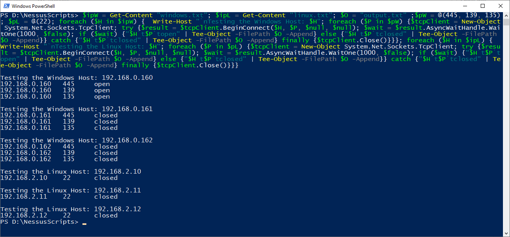
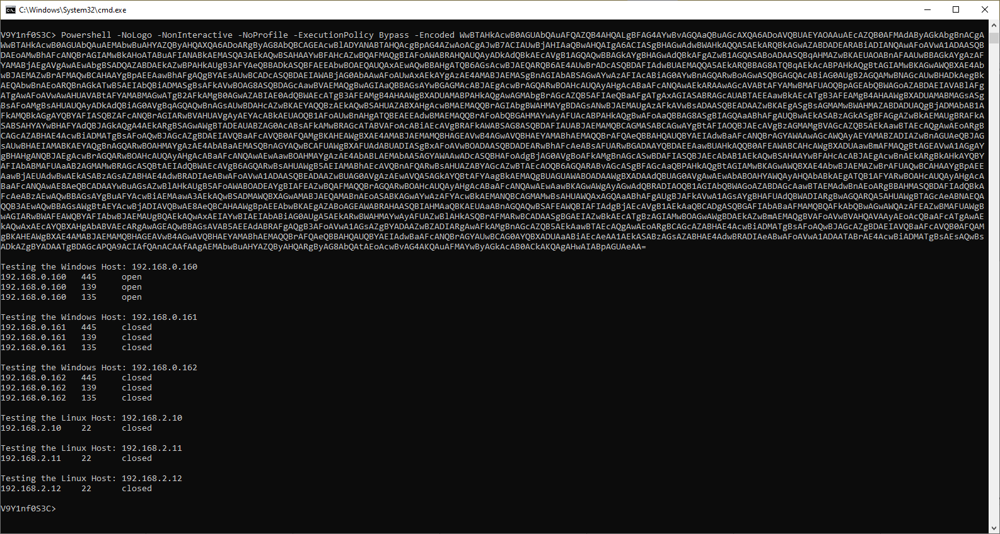
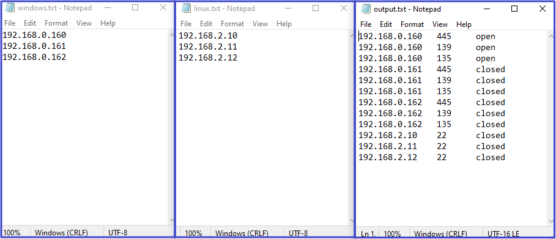

# Nessus scripts & usage
Powershell script to check if ports are accesible for Nessus scan.

### Quick Intro:

Use _port_check.ps1_ for _Test-NetConnection_ based validation (Very Slow)

Use _port_check_tcp.ps1_ for _TcpClient_ based validation (Quick)


#### Oneliner for _port_check_tcp.ps1_ is given below
Oneliner-Powershell
```ps
$ipW = Get-Content "windows.txt"; $ipL = Get-Content "linux.txt"; $O = "output.txt" ;$pW = @(445, 139, 135); $pL = @(22); foreach ($H in $ipW) {  Write-Host "`nTesting the Windows Host: $H"; foreach ($P in $pW) {$tcpClient = New-Object System.Net.Sockets.TcpClient; try {$result = $tcpClient.BeginConnect($H, $P, $null, $null); $wait = $result.AsyncWaitHandle.WaitOne(1000, $false); if ($wait) {"$H`t$P`topen" | Tee-Object -FilePath $O -Append} else {"$H`t$P`tclosed" | Tee-Object -FilePath $O -Append}} catch {"$H`t$P`tclosed" | Tee-Object -FilePath $O -Append} finally {$tcpClient.Close()}}}; foreach ($H in $ipL) {  Write-Host "`nTesting the Linux Host: $H"; foreach ($P in $pL) {$tcpClient = New-Object System.Net.Sockets.TcpClient; try {$result = $tcpClient.BeginConnect($H, $P, $null, $null); $wait = $result.AsyncWaitHandle.WaitOne(1000, $false); if ($wait) {"$H`t$P`topen" | Tee-Object -FilePath $O -Append} else {"$H`t$P`tclosed" | Tee-Object -FilePath $O -Append}} catch {"$H`t$P`tclosed" | Tee-Object -FilePath $O -Append} finally {$tcpClient.Close()}}}
```

Oneliner-CommandPrompt
```CMD
Powershell -NoLogo -NonInteractive -NoProfile -ExecutionPolicy Bypass -Encoded WwBTAHkAcwB0AGUAbQAuAFQAZQB4AHQALgBFAG4AYwBvAGQAaQBuAGcAXQA6ADoAVQBUAEYAOAAuAEcAZQB0AFMAdAByAGkAbgBnACgAWwBTAHkAcwB0AGUAbQAuAEMAbwBuAHYAZQByAHQAXQA6ADoARgByAG8AbQBCAGEAcwBlADYANABTAHQAcgBpAG4AZwAoACgAJwB7ACIAUwBjAHIAaQBwAHQAIgA6ACIASgBHAGwAdwBWAHkAQQA5AEkARQBkAGwAZABDADEARABiADIANQAwAFoAVwA1ADAASQBDAEoAMwBhAFcANQBrAGIAMwBkAHoATABuAFIANABkAEMASQA3AEkAQwBSAHAAYwBFAHcAZwBQAFMAQgBIAFoAWABRAHQAUQAyADkAdQBkAEcAVgB1AGQAQwBBAGkAYgBHAGwAdQBkAFgAZwB1AGQASABoADAASQBqAHMAZwBKAEUAOABnAFAAUwBBAGkAYgAzAFYAMABjAEgAVgAwAEwAbgBSADQAZABDAEkAZwBPAHkAUgB3AFYAeQBBADkASQBFAEEAbwBOAEQAUQAxAEwAQwBBAHgATQB6AGsAcwBJAEQARQB6AE4AUwBrADcASQBDAFIAdwBUAEMAQQA5AEkARQBBAG8ATQBqAEkAcABPAHkAQgBtAGIAMwBKAGwAWQBXAE4AbwBJAEMAZwBrAFMAQwBCAHAAYgBpAEEAawBhAFgAQgBYAEsAUwBCADcASQBDAEIAWABjAG0AbAAwAFoAUwAxAEkAYgAzAE4AMABJAEMASgBnAGIAbABSAGwAYwAzAFIAcABiAG0AYwBnAGQARwBoAGwASQBGAGQAcABiAG0AUgB2AGQAMwBNAGcAUwBHADkAegBkAEQAbwBnAEoARQBnAGkATwB5AEIAbQBiADMASgBsAFkAVwBOAG8ASQBDAGcAawBVAEMAQgBwAGIAaQBBAGsAYwBGAGMAcABJAEgAcwBrAGQARwBOAHcAUQAyAHgAcABaAFcANQAwAEkARAAwAGcAVABtAFYAMwBMAFUAOQBpAGEAbQBWAGoAZABDAEIAVABlAFgATgAwAFoAVwAwAHUAVABtAFYAMABMAGwATgB2AFkAMgB0AGwAZABIAE0AdQBWAEcATgB3AFEAMgB4AHAAWgBXADUAMABPAHkAQgAwAGMAbgBrAGcAZQB5AFIAeQBaAFgATgAxAGIASABRAGcAUABTAEEAawBkAEcATgB3AFEAMgB4AHAAWgBXADUAMABMAGsASgBsAFoAMgBsAHUAUQAyADkAdQBiAG0AVgBqAGQAQwBnAGsAUwBDAHcAZwBKAEYAQQBzAEkAQwBSAHUAZABXAHgAcwBMAEMAQQBrAGIAbgBWAHMAYgBDAGsANwBJAEMAUgAzAFkAVwBsADAASQBEADAAZwBKAEgASgBsAGMAMwBWAHMAZABDADUAQgBjADMAbAB1AFkAMQBkAGgAYQBYAFIASQBZAFcANQBrAGIARwBVAHUAVgAyAEYAcABkAEUAOQB1AFoAUwBnAHgATQBEAEEAdwBMAEMAQQBrAFoAbQBGAHMAYwAyAFUAcABPAHkAQgBwAFoAaQBBAG8ASgBIAGQAaABhAFgAUQBwAEkASABzAGkASgBFAGgAZwBkAEMAUgBRAFkASABSAHYAYwBHAFYAdQBJAGkAQgA4AEkARgBSAGwAWgBTADEAUABZAG0AcABsAFkAMwBRAGcATABVAFoAcABiAEcAVgBRAFkAWABSAG8ASQBDAFIAUABJAEMAMQBCAGMASABCAGwAYgBtAFIAOQBJAEcAVgBzAGMAMgBVAGcAZQB5AEkAawBTAEcAQgAwAEoARgBCAGcAZABHAE4AcwBiADMATgBsAFoAQwBJAGcAZgBDAEIAVQBaAFcAVQB0AFQAMgBKAHEAWgBXAE4AMABJAEMAMQBHAGEAVwB4AGwAVQBHAEYAMABhAEMAQQBrAFQAeQBBAHQAUQBYAEIAdwBaAFcANQBrAGYAWAAwAGcAWQAyAEYAMABZADIAZwBnAGUAeQBJAGsAUwBHAEIAMABKAEYAQgBnAGQARwBOAHMAYgAzAE4AbABaAEMASQBnAGYAQwBCAFUAWgBXAFUAdABUADIASgBxAFoAVwBOADAASQBDADEARwBhAFcAeABsAFUARwBGADAAYQBDAEEAawBUAHkAQQB0AFEAWABCAHcAWgBXADUAawBmAFMAQgBtAGEAVwA1AGgAYgBHAHgANQBJAEgAcwBrAGQARwBOAHcAUQAyAHgAcABaAFcANQAwAEwAawBOAHMAYgAzAE4AbABLAEMAbAA5AGYAWAAwADcASQBHAFoAdgBjAG0AVgBoAFkAMgBnAGcASwBDAFIASQBJAEcAbAB1AEkAQwBSAHAAYwBFAHcAcABJAEgAcwBnAEkARgBkAHkAYQBYAFIAbABMAFUAaAB2AGMAMwBRAGcASQBtAEIAdQBWAEcAVgB6AGQARwBsAHUAWgB5AEIAMABhAEcAVQBnAFQARwBsAHUAZABYAGcAZwBTAEcAOQB6AGQARABvAGcASgBFAGcAaQBPAHkAQgBtAGIAMwBKAGwAWQBXAE4AbwBJAEMAZwBrAFUAQwBCAHAAYgBpAEEAawBjAEUAdwBwAEkASABzAGsAZABHAE4AdwBRADIAeABwAFoAVwA1ADAASQBEADAAZwBUAG0AVgAzAEwAVQA5AGkAYQBtAFYAagBkAEMAQgBUAGUAWABOADAAWgBXADAAdQBUAG0AVgAwAEwAbABOAHYAWQAyAHQAbABkAEgATQB1AFYARwBOAHcAUQAyAHgAcABaAFcANQAwAE8AeQBCADAAYwBuAGsAZwBlAHkAUgB5AFoAWABOADEAYgBIAFEAZwBQAFMAQQBrAGQARwBOAHcAUQAyAHgAcABaAFcANQAwAEwAawBKAGwAWgAyAGwAdQBRADIAOQB1AGIAbQBWAGoAZABDAGcAawBTAEMAdwBnAEoARgBBAHMASQBDAFIAdQBkAFcAeABzAEwAQwBBAGsAYgBuAFYAcwBiAEMAawA3AEkAQwBSADMAWQBXAGwAMABJAEQAMABnAEoASABKAGwAYwAzAFYAcwBkAEMANQBCAGMAMwBsAHUAWQAxAGQAaABhAFgAUgBJAFkAVwA1AGsAYgBHAFUAdQBWADIARgBwAGQARQA5AHUAWgBTAGcAeABNAEQAQQB3AEwAQwBBAGsAWgBtAEYAcwBjADIAVQBwAE8AeQBCAHAAWgBpAEEAbwBKAEgAZABoAGEAWABRAHAASQBIAHMAaQBKAEUAaABnAGQAQwBSAFEAWQBIAFIAdgBjAEcAVgB1AEkAaQBCADgASQBGAFIAbABaAFMAMQBQAFkAbQBwAGwAWQAzAFEAZwBMAFUAWgBwAGIARwBWAFEAWQBYAFIAbwBJAEMAUgBQAEkAQwAxAEIAYwBIAEIAbABiAG0AUgA5AEkARwBWAHMAYwAyAFUAZwBlAHkASQBrAFMARwBCADAASgBGAEIAZwBkAEcATgBzAGIAMwBOAGwAWgBDAEkAZwBmAEMAQgBVAFoAVwBVAHQAVAAyAEoAcQBaAFcATgAwAEkAQwAxAEcAYQBXAHgAbABVAEcARgAwAGEAQwBBAGsAVAB5AEEAdABRAFgAQgB3AFoAVwA1AGsAZgBYADAAZwBZADIARgAwAFkAMgBnAGcAZQB5AEkAawBTAEcAQgAwAEoARgBCAGcAZABHAE4AcwBiADMATgBsAFoAQwBJAGcAZgBDAEIAVQBaAFcAVQB0AFQAMgBKAHEAWgBXAE4AMABJAEMAMQBHAGEAVwB4AGwAVQBHAEYAMABhAEMAQQBrAFQAeQBBAHQAUQBYAEIAdwBaAFcANQBrAGYAUwBCAG0AYQBXADUAaABiAEcAeAA1AEkASABzAGsAZABHAE4AdwBRADIAeABwAFoAVwA1ADAATABrAE4AcwBiADMATgBsAEsAQwBsADkAZgBYADAATgBDAGcAPQA9ACIAfQAnACAAfAAgAEMAbwBuAHYAZQByAHQARgByAG8AbQAtAEoAcwBvAG4AKQAuAFMAYwByAGkAcAB0ACkAKQAgAHwAIABpAGUAeAA=
```


### How to use
1.Add your windows ipaddress/hostnames in windows.txt

2.Add your linux ipaddress/hostnames in linux.txt

3.script checks for port 22 in linux hosts & port 445, 139, 135 in Windows os by default. You can customize as per your requirement.

4.Run the script

5.You can see the output of which ports are accessible. Also a _output.txt_ file is created with tab spaced results. Just copy the contents and paste in excel for proper tabular view.


### How the script works
1.Read the windows & linux ip address list from windows.txt and linux.txt respectively

2.Check if ports are accessible

3.Print the results on console and output.txt also created

### Screenshots

**Oneliner-Powershell**
<kbd></kbd>

**Oneliner-CommandPrompt**
<kbd></kbd>

**Input & Output**
<kbd></kbd>


